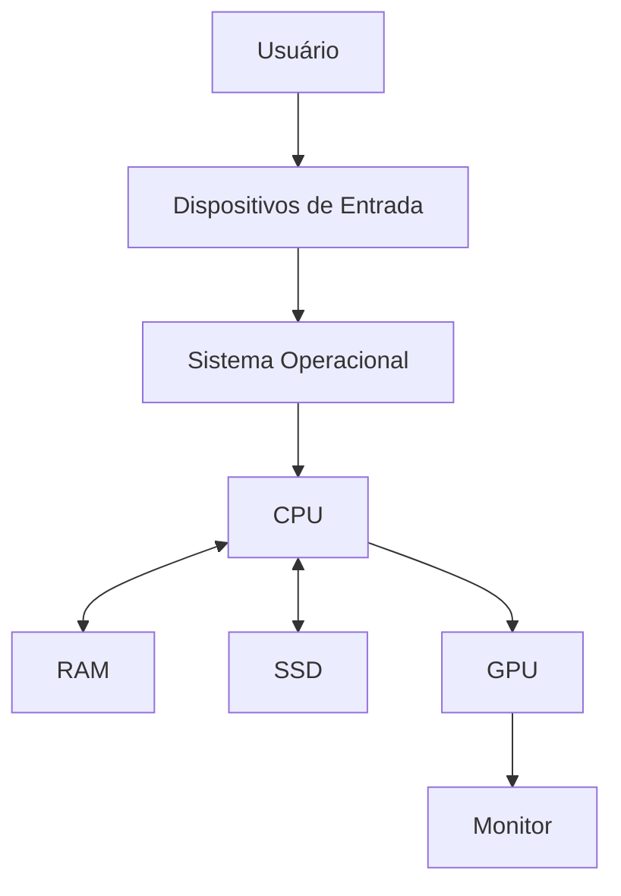
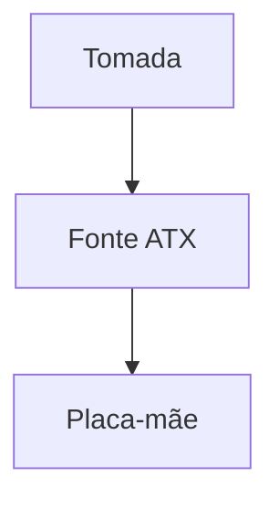
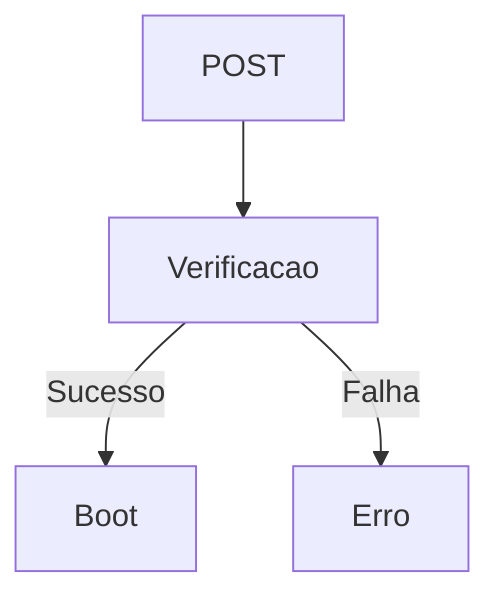
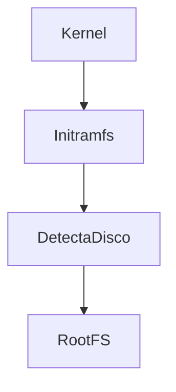
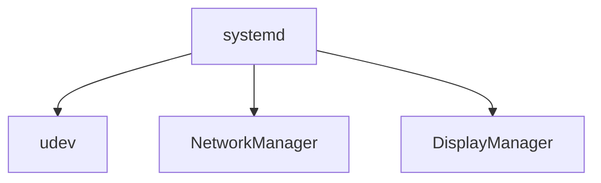
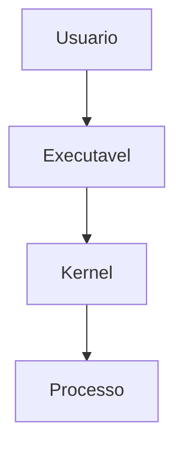
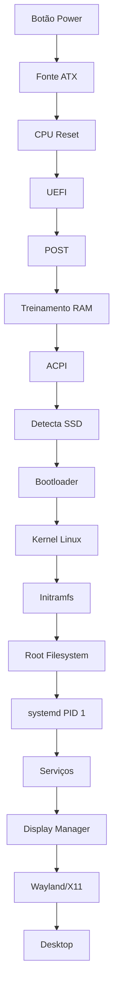

# <div align="center">Funcionamento Completo de um Computador</div> <div align="center">(>‿◠)✌</div>

## <div align="center">Hardware ao Sistema Operacional</div>

---

# <div align="center">Sumário</div>

1. Introdução
2. Arquitetura Geral
3. Hardware

   * Placa-mãe
   * CPU
   * Cache
   * RAM
   * SSD e HD
   * GPU
4. Processo de Inicialização
5. Firmware (BIOS/UEFI)
6. Bootloader
7. Kernel Linux
8. Initramfs
9. Gerenciamento de Memória
10. Sistema de Arquivos
11. Processos
12. Systemd
13. Ambiente Gráfico
14. Fluxo Completo da Inicialização

---

# <div align="center">Introdução</div>

Um computador é uma máquina eletrônica capaz de receber dados, processá-los, armazená-los e produzir resultados.

Ele é composto por duas partes fundamentais:

## Hardware

Parte física do sistema:

* Processador (CPU)
* Memória RAM
* SSD/HD
* GPU
* Placa-mãe
* Fonte de alimentação

## Software

Parte lógica do sistema:

* Firmware (UEFI/BIOS)
* Kernel
* Drivers
* Bibliotecas
* Aplicações

---

# <div align="center">Arquitetura Geral</div>



---

# <div align="center">Hardware</div>

## Placa-mãe

A placa-mãe é a principal placa eletrônica do computador.

Responsabilidades:

* Interligar todos os componentes
* Distribuir energia
* Hospedar o firmware UEFI
* Fornecer barramentos de comunicação

### Principais Barramentos

| Barramento | Função                 |
| ---------- | ---------------------- |
| PCIe       | GPU, SSD NVMe e placas |
| SATA       | HDs e SSDs SATA        |
| USB        | Periféricos            |
| SPI        | Firmware UEFI          |
| SMBus      | Sensores               |

---

## CPU (Central Processing Unit)

A CPU é responsável pela execução das instruções.

### Componentes Internos

#### Unidade de Controle (CU)

Coordena a execução das instruções.

#### ALU (Arithmetic Logic Unit)

Executa:

* Soma
* Subtração
* Multiplicação
* Divisão
* Operações lógicas

#### Registradores

Memória ultrarrápida dentro da CPU.

Exemplos:

| Registrador | Função            |
| ----------- | ----------------- |
| RIP         | Próxima instrução |
| RSP         | Pilha             |
| RAX         | Dados gerais      |

---

## Pipeline

Uma instrução passa por várias etapas:


### Fetch

Busca a instrução na memória.

### Decode

Interpreta a instrução.

### Execute

Executa a operação.

### Memory Access

Acessa RAM se necessário.

### Write Back

Salva o resultado.

---

## Cache

Memória extremamente rápida.

```text
Registradores
      ↓
Cache L1
      ↓
Cache L2
      ↓
Cache L3
      ↓
RAM
```

### L1

Mais rápida.

### L2

Intermediária.

### L3

Compartilhada entre núcleos.

---

## RAM

Memória principal do computador.

Armazena:

* Kernel
* Programas em execução
* Dados temporários

Características:

* Volátil
* Alta velocidade
* Apagada ao desligar

---

## SSD

Armazenamento permanente.

### SATA

Até aproximadamente:

550 MB/s

### NVMe

Utiliza PCI Express.

Pode ultrapassar:

* 3 GB/s
* 7 GB/s
* 14 GB/s

---

## GPU

Processador especializado em paralelismo.

Utilizado para:

* Jogos
* IA
* Renderização
* Processamento gráfico

---

# <div align="center">Processo de Inicialização</div>

## Energia

Quando o botão Power é pressionado:



A fonte converte:

```text
Corrente Alternada (AC)
↓
Corrente Contínua (DC)
```

Fornecendo:

* 12V
* 5V
* 3.3V

---

# <div align="center">Firmware</div>

## BIOS

Sistema legado de inicialização.

## UEFI

Substituto moderno da BIOS.

Responsável por:

* Inicializar hardware
* Detectar memória
* Detectar discos
* Executar bootloader

---

# <div align="center">POST</div>

Power-On Self Test

Verificações realizadas:

* CPU
* RAM
* GPU
* Controladores



---

# <div align="center">Treinamento da Memória</div>

O controlador de memória descobre:

* Frequência
* Latência
* Timings

Exemplo:

```text
DDR5 6000 MT/s
CL30
```

---

# <div align="center">Seleção do Dispositivo de Boot</div>

UEFI procura dispositivos:

1. SSD
2. HD
3. Pendrive
4. Rede

---

# <div align="center">Partição EFI</div>

Estrutura típica:

```text
EFI/
├── Microsoft/
├── GRUB/
├── systemd/
└── Boot/
```

Formato:

```text
FAT32
```

---

# <div align="center">Bootloader</div>

Exemplos:

* GRUB
* systemd-boot
* rEFInd

Funções:

* Localizar kernel
* Carregar initramfs
* Passar parâmetros ao kernel

---

# <div align="center">Kernel Linux</div>

Arquivo típico:

```text
vmlinuz-linux
```

Responsabilidades:

* Processos
* Memória
* Arquivos
* Rede
* Drivers

---

# <div align="center">Initramfs</div>

Sistema Linux temporário carregado na RAM.

Contém:

* Drivers
* Scripts
* Utilitários

Fluxo:



---

# <div align="center">Gerenciamento de Memória</div>

## Memória Virtual

Programas não enxergam a memória física diretamente.

```text
Memória Virtual
       ↓
MMU
       ↓
Memória Física
```

---

## MMU

Memory Management Unit

Responsável por:

* Tradução de endereços
* Proteção de memória
* Paginação

---

## Paginação

Cada processo possui:

* Espaço virtual próprio
* Tabelas de páginas

Benefícios:

* Segurança
* Isolamento
* Estabilidade

---

# <div align="center">Root Filesystem</div>

Após localizar o sistema:

```bash
switch_root
```

ou

```bash
pivot_root
```

O initramfs entrega o controle ao sistema principal.

---

# <div align="center">PID 1</div>

Primeiro processo do Linux.

Normalmente:

```text
systemd
```

PID:

```text
1
```

---

# <div align="center">Systemd</div>

Responsável por:

* Inicialização
* Serviços
* Rede
* Logs
* Login

Fluxo:



---

# <div align="center">Udev</div>

Gerencia dispositivos.

Exemplo:

```text
Mouse conectado
↓
Kernel gera evento
↓
udev processa
↓
/dev/input/*
```

---

# <div align="center">Sistema de Arquivos</div>

Estrutura Linux:

```text
/
├── bin
├── boot
├── dev
├── etc
├── home
├── lib
├── proc
├── sys
├── tmp
├── usr
└── var
```

---

# <div align="center">ProcFS</div>

Sistema virtual.

Exemplos:

```text
/proc/cpuinfo
/proc/meminfo
```

Gerado dinamicamente pelo kernel.

---

# <div align="center">SysFS</div>

Representação dos dispositivos.

```text
/sys
```

---

# <div align="center">Processos</div>

Quando um programa é executado:



---

# <div align="center">Chamadas de Sistema</div>

Aplicações acessam recursos através de Syscalls.

Exemplos:

```c
open()
read()
write()
mmap()
fork()
execve()
```

---

# <div align="center">Escalonador</div>

Alterna entre processos.

```text
Processo A
↓
Processo B
↓
Processo C
↓
Processo A
```

Chamado de:

```text
Context Switch
```

---

# <div align="center">Interrupções</div>

Eventos externos que interrompem a CPU.

Exemplo:

```text
Tecla pressionada
↓
Controlador
↓
Interrupção
↓
CPU
```

---

# <div align="center">DMA</div>

Direct Memory Access

Permite transferência direta:

```text
SSD
↓
RAM
```

Sem participação constante da CPU.

---

# <div align="center">Ambiente Gráfico</div>

## Display Manager

Responsável pela tela de login.

Exemplos:

* GDM
* SDDM
* LightDM

---

## Servidor Gráfico

### X11

Sistema tradicional.

### Wayland

Sistema moderno.

---

## Compositor

Exemplos:

* Hyprland
* Sway
* KWin
* Mutter

Funções:

* Janelas
* Animações
* Transparência

---

# <div align="center">Fluxo Completo da Inicialização</div>



---

# <div align="center">Conclusão</div>

Desde o momento em que o botão Power é pressionado até a abertura de uma aplicação gráfica, milhões de operações são realizadas.

O fluxo geral é:

```text
Energia
↓
UEFI
↓
POST
↓
Bootloader
↓
Kernel
↓
Initramfs
↓
Root Filesystem
↓
systemd
↓
Serviços
↓
Wayland/X11
↓
Desktop
↓
Aplicações
```

Cada etapa depende da anterior, formando uma cadeia complexa que transforma energia elétrica em processamento de informação.
