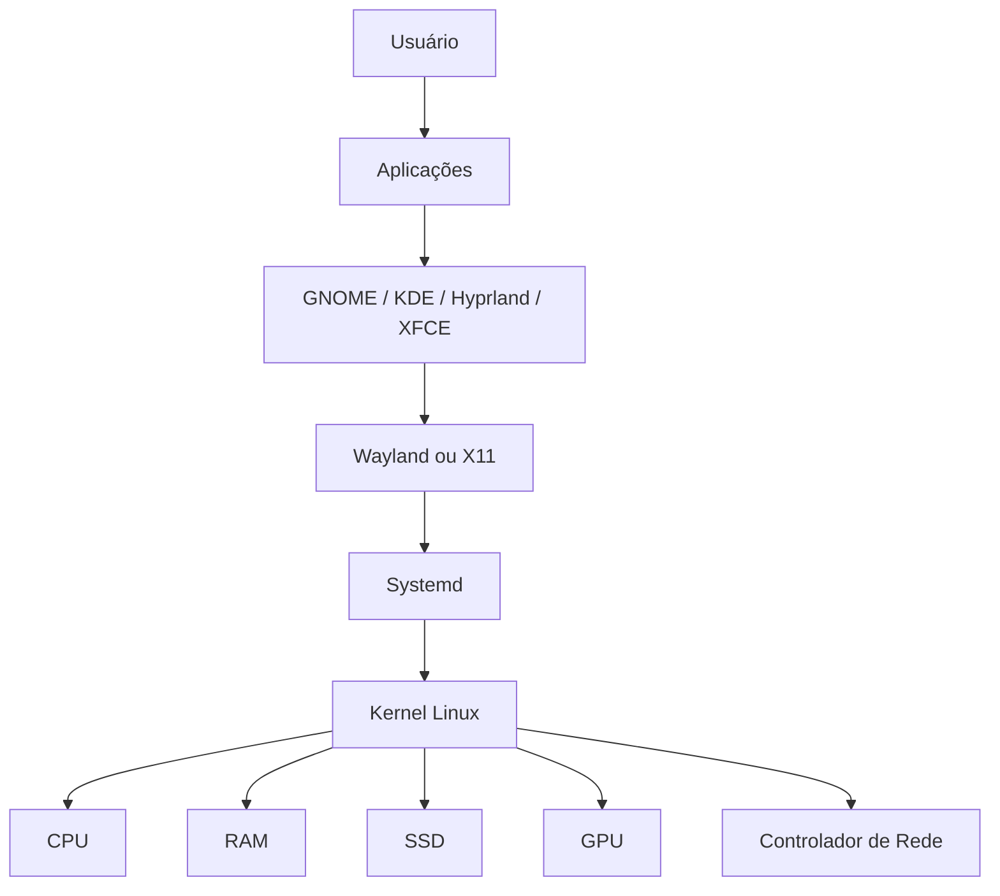
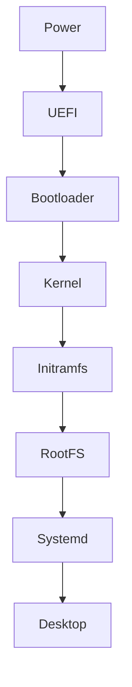
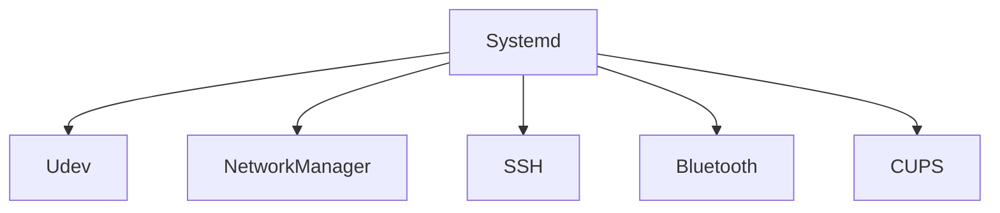
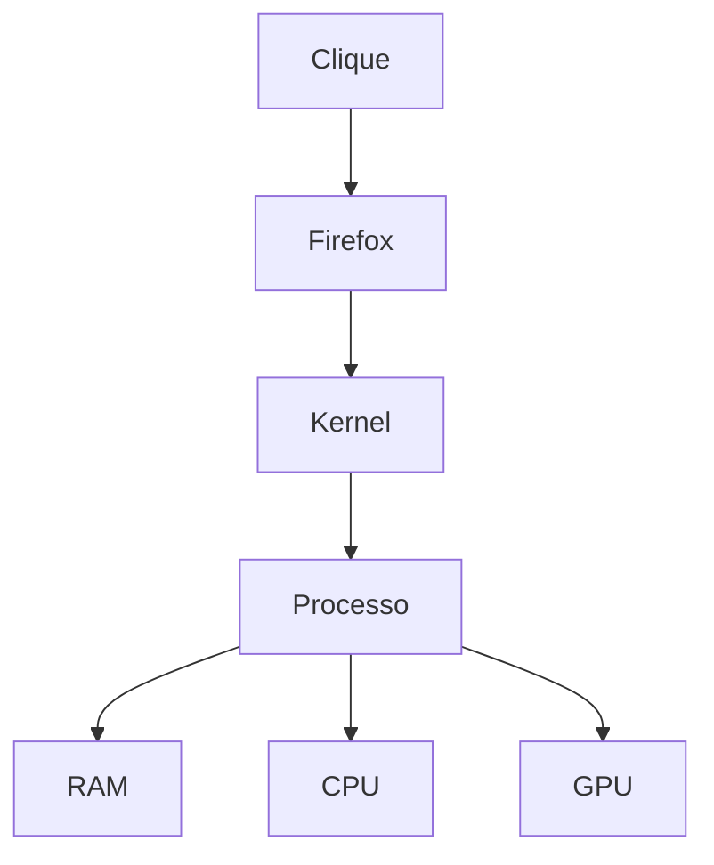
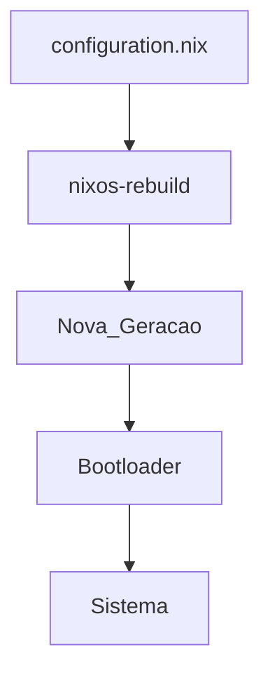
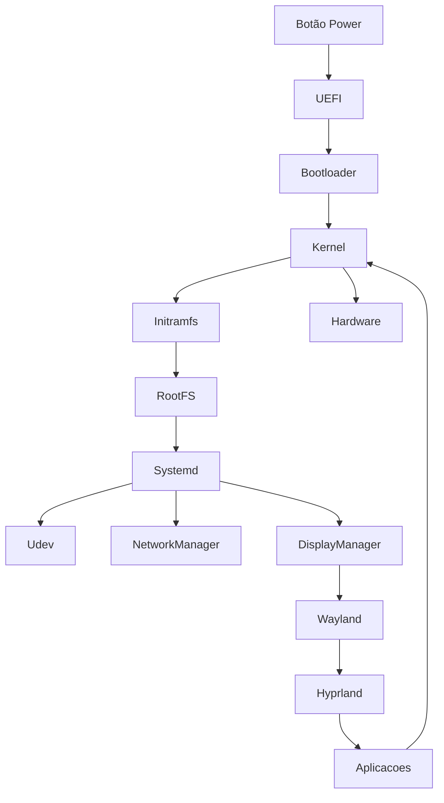

# <div align="center">🐧Distribuição Linux na Computação ˙𐃷˙</div>

## <div align="center">Introdução</div>

Uma distribuição Linux (distro) é a união de diversos componentes de software que trabalham sobre o hardware do computador.

Quando o computador é ligado, o hardware fornece a base física para execução. A distribuição Linux fornece todas as ferramentas necessárias para transformar esse hardware em um sistema operacional utilizável.

Uma distro não é apenas o Kernel Linux.

Ela é composta por:

- Kernel Linux
- Bootloader
- Initramfs
- Systemd (ou outro init)
- Drivers
- Bibliotecas
- Shell
- Gerenciador de Pacotes
- Ambiente Gráfico
- Aplicações

---

# <div align="center">Arquitetura Geral</div>



---

# <div align="center">O Que é uma Distribuição Linux</div>

O Linux é dividido em duas partes principais:

## Kernel

O núcleo do sistema.

Responsável por:

- Processos
- Memória
- Arquivos
- Drivers
- Rede

Exemplo:

```text
Linux 6.x
```

---

## User Space

Programas executados sobre o Kernel.

Exemplos:

```text
Bash
Systemd
Coreutils
Firefox
Hyprland
NetworkManager
```

---

# <div align="center">Onde a Distro Entra na Inicialização</div>

## Firmware

Primeira etapa da inicialização.

```text
UEFI
```

ou

```text
BIOS
```

Responsável por:

- Inicializar CPU
- Inicializar RAM
- Detectar dispositivos
- Localizar um dispositivo de boot

---

## Bootloader

A distribuição instala um bootloader.

Exemplos:

```text
GRUB
systemd-boot
rEFInd
```

Função:

- Encontrar o Kernel
- Encontrar o Initramfs
- Passar parâmetros ao Kernel
- Iniciar o Linux

---

# <div align="center">Estrutura do Boot</div>



---

# <div align="center">Kernel Linux</div>

Toda distribuição possui um Kernel Linux.

O Kernel é responsável por controlar:

## CPU

Escalonamento de processos.

```text
CFS Scheduler
```

---

## Memória

Gerenciamento de:

- RAM
- Swap
- Paginação
- Cache

---

## SSD

Controle dos sistemas de arquivos.

Exemplos:

```text
EXT4
BTRFS
XFS
ZFS
```

---

## Rede

Implementação da pilha TCP/IP.

```text
Ethernet
Wi-Fi
IPv4
IPv6
TCP
UDP
```

---

## GPU

Comunicação com:

```text
Mesa
DRM
KMS
NVIDIA Driver
```

---

# <div align="center">Drivers</div>

Drivers são módulos carregados pelo Kernel.

## Intel

```text
i915
xe
```

## AMD

```text
amdgpu
```

## NVIDIA

```text
nvidia
nouveau
```

## Wi-Fi

```text
iwlwifi
ath11k
rtw89
```

---

# <div align="center">Initramfs</div>

Após o Kernel iniciar:

```text
initramfs
```

é carregado.

Funções:

- Detectar SSD
- Detectar NVMe
- Descriptografar LUKS
- Configurar RAID
- Configurar LVM
- Montar o sistema principal

---

# <div align="center">Root Filesystem</div>

Após localizar o disco:

```bash
switch_root
```

ou

```bash
pivot_root
```

O Initramfs entrega o controle ao sistema principal.

---

# <div align="center">Estrutura da Distro</div>

```text
/
├── bin
├── boot
├── dev
├── etc
├── home
├── lib
├── proc
├── sys
├── tmp
├── usr
└── var
```

---

# <div align="center">O Papel do Systemd</div>

O Systemd normalmente é o primeiro processo do sistema.

```text
PID 1
```

Responsável por:

- Inicialização
- Serviços
- Rede
- Login
- Logs

---

# <div align="center">Serviços da Distro</div>

Exemplos:

```text
systemd-udevd
NetworkManager
sshd
cups
bluetoothd
```

Fluxo:



---

# <div align="center">Udev</div>

Gerencia dispositivos dinamicamente.

Exemplo:

```text
Pendrive conectado
↓
Kernel detecta
↓
Udev cria
↓
/dev/sdb
```

---

# <div align="center">Gerenciador de Pacotes</div>

Toda distro possui um sistema de gerenciamento.

## Arch Linux

```bash
pacman
```

## Debian / Ubuntu

```bash
apt
```

## Fedora

```bash
dnf
```

## openSUSE

```bash
zypper
```

## NixOS

```bash
nix
```

---

# <div align="center">Ambiente Gráfico</div>

A distro também fornece o desktop.

## GNOME

Interface moderna.

## KDE Plasma

Altamente personalizável.

## XFCE

Leve.

## Hyprland

Compositor Wayland moderno.

---

# <div align="center">Relação com Wayland</div>

Fluxo gráfico:


---

# <div align="center">Bibliotecas</div>

Aplicações dependem de bibliotecas compartilhadas.

Exemplos:

```text
glibc
libstdc++
openssl
gtk
qt
```

---

# <div align="center">Execução de um Programa</div>

Quando o usuário abre o Firefox:



---

# <div align="center">O Que Diferencia uma Distro da Outra</div>

O hardware continua exatamente o mesmo.

O Kernel geralmente é muito parecido.

O que muda é:

- Gerenciador de Pacotes
- Configuração do Sistema
- Repositórios
- Ambiente Gráfico
- Ferramentas padrão

---

## Exemplos

| Distro | Característica |
|----------|----------|
| Arch Linux | Rolling Release |
| Debian | Estabilidade |
| Ubuntu | Facilidade de uso |
| Fedora | Tecnologias recentes |
| openSUSE | Ferramentas administrativas |
| NixOS | Configuração declarativa |

---

# <div align="center">Onde o NixOS é Diferente</div>

O NixOS utiliza:

```text
Nix Package Manager
```

Toda configuração do sistema é declarativa.

Arquivo principal:

```text
/etc/nixos/configuration.nix
```

Fluxo:



Benefícios:

- Rollback
- Reprodutibilidade
- Configuração declarativa
- Ambientes isolados

---

# <div align="center">Fluxo Completo do Linux</div>



---

# <div align="center">Resumo</div>

```text
Hardware
    ↓
Firmware (UEFI)
    ↓
Bootloader
    ↓
Kernel Linux
    ↓
Drivers
    ↓
Systemd
    ↓
Serviços
    ↓
Wayland/X11
    ↓
Desktop
    ↓
Aplicações
    ↓
Usuário
```
