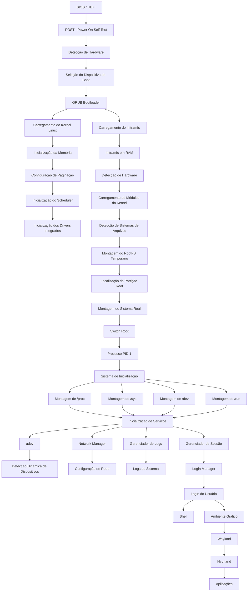

```mermaid
flowchart TD

    A[BIOS / UEFI] --> B[POST - Power On Self Test]

    B --> C[Detecção de Hardware]
    C --> D[Seleção do Dispositivo de Boot]

    D --> E[GRUB Bootloader]

    E --> F[Carregamento do Kernel Linux]
    E --> G[Carregamento do Initramfs]

    F --> H[Inicialização da Memória]
    H --> I[Configuração de Paginação]
    I --> J[Inicialização do Scheduler]
    J --> K[Inicialização dos Drivers Integrados]

    G --> L[Initramfs em RAM]

    L --> M[Detecção de Hardware]
    M --> N[Carregamento de Módulos do Kernel]
    N --> O[Detecção de Sistemas de Arquivos]
    O --> P[Montagem do RootFS Temporário]

    P --> Q[Localização da Partição Root]
    Q --> R[Montagem do Sistema Real]

    R --> S[Switch Root]

    S --> T[Processo PID 1]

    T --> U[Sistema de Inicialização]

    U --> V[Montagem de /proc]
    U --> W[Montagem de /sys]
    U --> X[Montagem de /dev]
    U --> Y[Montagem de /run]

    V --> Z[Inicialização de Serviços]
    W --> Z
    X --> Z
    Y --> Z

    Z --> AA[udev]
    Z --> AB[Network Manager]
    Z --> AC[Gerenciador de Logs]
    Z --> AD[Gerenciador de Sessão]

    AA --> AE[Detecção Dinâmica de Dispositivos]

    AB --> AF[Configuração de Rede]

    AC --> AG[Logs do Sistema]

    AD --> AH[Login Manager]

    AH --> AI[Login do Usuário]

    AI --> AJ[Shell]
    AI --> AK[Ambiente Gráfico]

    AK --> AL[Wayland]
    AL --> AM[Hyprland]

    AM --> AN[Aplicações]
```
