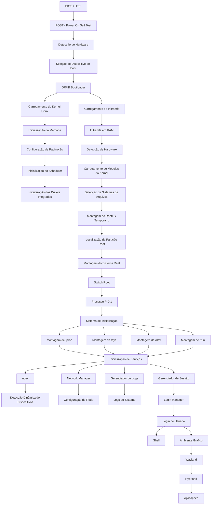

# Processo Completo de Inicialização do Sistema

## Visão Geral

O processo de inicialização da distribuição é dividido em diversas etapas, desde a energização do hardware até a exibição do ambiente gráfico para o usuário.

```text
Hardware
↓
BIOS/UEFI
↓
Bootloader (GRUB)
↓
Kernel Linux
↓
Initramfs
↓
RootFS
↓
Sistema de Inicialização (PID 1)
↓
Serviços do Sistema
↓
Login Manager
↓
Wayland
↓
Hyprland
↓
Aplicações
```

---

# 1. BIOS / UEFI

A BIOS (Basic Input Output System) ou UEFI (Unified Extensible Firmware Interface) é responsável por preparar o hardware para execução do sistema operacional.

## Responsabilidades

* Inicialização da CPU
* Teste da memória RAM
* Detecção de dispositivos PCIe
* Inicialização de controladores SATA/NVMe
* Configuração básica do chipset
* Seleção do dispositivo de boot

## POST (Power-On Self Test)

Durante o POST o firmware verifica:

* Processador
* Memória RAM
* GPU
* Teclado
* Controladores de armazenamento

Após a conclusão do POST o controle é transferido ao dispositivo de boot.

---

# 2. Bootloader (GRUB)

O GRUB é carregado pelo firmware e possui a responsabilidade de iniciar o kernel Linux.

## Funções

* Exibir menu de boot
* Selecionar entradas do sistema
* Carregar o kernel
* Carregar o initramfs
* Passar parâmetros para o kernel

## Arquivos Principais

```text
/boot/grub/grub.cfg
/boot/vmlinuz-linux
/boot/initramfs-linux.img
```

## Parâmetros de Kernel

Exemplos:

```text
root=/dev/nvme0n1p2
quiet
loglevel=3
rw
```

---

# 3. Kernel Linux

O kernel é o núcleo do sistema operacional.

Após ser carregado pelo GRUB, o kernel assume controle total do hardware.

## Inicialização da CPU

Configuração de:

* Tabelas de interrupção
* Modos de execução
* Multiprocessamento SMP

## Gerenciamento de Memória

Configuração de:

* Paginação
* Memória virtual
* Cache de páginas
* Slab Allocator

## Scheduler

Inicialização do escalonador responsável por:

* Criar processos
* Distribuir carga entre CPUs
* Controlar prioridades

## Drivers Integrados

O kernel inicializa drivers compilados diretamente:

* ACPI
* USB
* PCI
* NVMe
* SATA
* EXT4
* FAT32

---

# 4. Initramfs

O Initramfs é um pequeno sistema Linux carregado inteiramente na memória RAM.

Sua função é preparar o ambiente antes da montagem do sistema principal.

## Estrutura

```text
/bin
/sbin
/lib
/usr
/init
```

## Componentes

### BusyBox

Fornece ferramentas essenciais:

```text
mount
sh
cp
mv
cat
```

### udev

Responsável por detectar dispositivos dinamicamente.

### cryptsetup

Utilizado para descriptografar partições LUKS.

### lvm2

Gerenciamento de volumes lógicos.

### mdadm

Gerenciamento de RAID.

---

# 5. Descoberta do Sistema Raiz

O initramfs localiza a partição principal.

Exemplo:

```text
/dev/nvme0n1p2
```

Após localizar:

```text
mount /dev/nvme0n1p2 /newroot
```

Em seguida ocorre:

```text
switch_root
```

O sistema temporário é descartado e o sistema real assume o controle.

---

# 6. Processo PID 1

O primeiro processo criado pelo kernel recebe PID 1.

Exemplo:

```text
/sbin/init
```

ou

```text
/usr/lib/systemd/systemd
```

## Responsabilidades

* Inicializar serviços
* Gerenciar processos
* Monitorar falhas
* Encerrar serviços

---

# 7. Montagem dos Pseudo Filesystems

Antes da inicialização dos serviços o sistema monta:

```text
/proc
/sys
/dev
/run
```

## /proc

Informações de processos e kernel.

## /sys

Interface entre kernel e espaço de usuário.

## /dev

Dispositivos do sistema.

## /run

Arquivos temporários em memória.

---

# 8. Inicialização dos Serviços

Serviços essenciais são carregados.

## udev

Gerenciamento de dispositivos.

## dbus

Comunicação entre processos.

## NetworkManager

Gerenciamento de rede.

## cron

Execução de tarefas agendadas.

## sshd

Acesso remoto.

## journald

Coleta de logs.

---

# 9. Sistema de Pacotes

O gerenciador de pacotes mantém o sistema atualizado.

## Componentes

### Repositórios

Servidores contendo pacotes.

### Banco de Dados Local

Registro dos pacotes instalados.

### Resolução de Dependências

Determina bibliotecas necessárias.

### Verificação de Assinaturas

Validação criptográfica dos pacotes.

### Instalação

Extração de arquivos:

```text
/usr/bin
/usr/lib
/etc
```

---

# 10. Login Manager

Após a inicialização dos serviços o sistema apresenta a tela de login.

Exemplos:

```text
greetd
sddm
gdm
lightdm
```

Funções:

* Autenticação
* Criação de sessão
* Inicialização gráfica

---

# 11. Wayland

Wayland é o protocolo gráfico moderno responsável pela comunicação entre aplicações e compositor.

## Responsabilidades

* Renderização
* Entrada de teclado
* Entrada de mouse
* Gerenciamento de janelas

---

# 12. Hyprland

O Hyprland atua como compositor Wayland.

## Recursos

* Gerenciamento de janelas
* Workspaces dinâmicos
* Animações
* Atalhos de teclado
* Controle de monitores

## Componentes Associados

```text
waybar
rofi
dunst
swww
kitty
```

---

# 13. Sessão do Usuário

Após a autenticação são iniciados:

```text
Shell
↓
Variáveis de Ambiente
↓
Aplicações de Inicialização
↓
Waybar
↓
Serviços do Usuário
↓
Aplicações
```

O sistema está totalmente operacional neste estágio.


